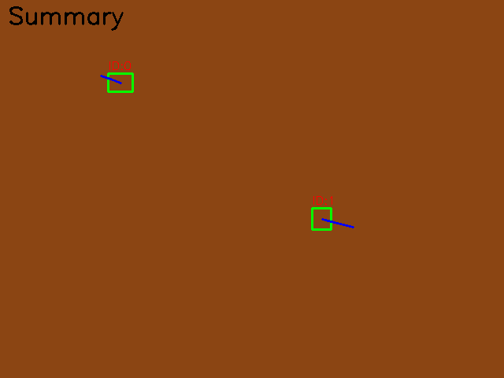

# Crop Tracking – C++ Reference Implementation  
*(Agricultural-Robotics Take-Home Challenge – June 2025)*



---

## ✨ What’s in this repo?

| Path / File | Purpose |
|-------------|---------|
| `src/` | C++17 source (`main.cpp`, `tracker.hpp/.cpp`) |
| `include/` | Third-party single-header `json.hpp` |
| `CMakeLists.txt` | Cross-platform build script |
| `Dockerfile` | Multistage Ubuntu 22.04 image (build + slim runtime) |
| `data/input/` | **Test datasets** – see table below |
| `data/output/` | Autocreated; tracker writes JSON + PNGs here |
| `tools/check_ids.py` | Consistency validator (ID never switches) |
| `run_all_examples.bat` / `run_all_examples.sh` | Batch-process every dataset |
| `README.md` | Quick-start guide (this file) |
| `SUBMISSION.md` | Deep-dive into modelling, design choices, and test plan |
| `LICENSE` | MIT |

---

## 1  Building locally

```bash
# Windows / macOS / Linux
mkdir build && cd build
cmake .. -DCMAKE_BUILD_TYPE=Release
cmake --build . -- -j$(nproc)
```

Produces `crop_tracking[.exe]` in `build/`.

### Quick test

```bash
build/crop_tracking \
  --input  data/input/simple_3_frames.json \
  --output data/output/simple_3_frames/tracking_output.json \
  --vis-dir data/output/simple_3_frames/visualization
```

---

## 2  Running with Docker

```bash
# build image (≈ 400 MB with OpenCV runtime libs)
docker build -t tracking-solution .

# run a single dataset
docker run --rm -v "$(pwd)":/project tracking-solution \
  --input  /project/data/input/simple_3_frames.json \
  --output /project/data/output/simple_3_frames/tracking_output.json \
  --vis-dir /project/data/output/simple_3_frames/visualization
```

`summary.png` & per-frame PNGs appear under `data/output/<dataset>/visualization`.

### Batch-run every dataset (Windows)

```cmd
run_all_examples.bat
```

(Linux users: `bash run_all_examples.sh`).

---

## 3  Dataset catalogue & edge-cases

| Dataset file (🗂 `data/input/`) | Frames | Avg. objs / frame | Edge‑case focus | What to verify |
|--------------------------------|:-----:|:-----------------:|-----------------|----------------|
| **simple_3_frames.json** | 3 | 1 | Happy-path sanity check | ID `0` persists |
| **occlusion_1frame.json** | 6 | 2‑3 | Disappear ≤ 1 frame | Same ID after gap |
| **occlusion_3frames.json** | 10 | 2‑3 | Longest allowed gap (3) | Still same ID |
| **overlapping.json** | 8 | 2 | Heavy IoU overlap | No ID swap |
| **many_objects_100.json** | 10 | **100** | Density / perf stress | < 15 ms per frame |
| **long_200_frames.json** | 200 | 5‑8 | Runtime & memory stability | No leak / drift |
| **pixel_coords.json** | 5 | 3 | *Pixel* coords input | Output in 0‑1 range |
| **frame_0001.json** / `0002` | 1 ea. | 2 | Numbers as *strings* (YOLO) | Parser robustness |

> Outputs land in `data/output/<dataset>/…`.

---

## 4  Validation

* **Visual check** – open each `summary.png`.  
* **Automated** – run `python tools/check_ids.py <tracking_output.json>`  
  (script is called automatically by the batch files).

Example:

```bash
python tools/check_ids.py data/output/occlusion_1frame/tracking_output.json
# ✅ IDs are consistent
```

---

## 5  Algorithm overview

* **Nearest‑centroid assignment** with `MAX_DIST = 0.08 × diag`  
* **ID hold‑over** = `MAX_MISSING = 3` frames  
* Only `(x, y, w, h, miss_count)` stored per object → tiny memory footprint  
* Visualisation layers: bounding box, label, motion trail, summary heatmap

Details and trade‑offs are fully documented in **`SUBMISSION.md`**.

---

## 6  Extending

| Want… | Change |
|-------|--------|
| Faster global assignment | Plug in Hungarian algorithm in `tracker.cpp`. |
| Motion prediction | Swap centroid matcher for Kalman or α‑β filter. |
| Sensor fusion | Augment `TrackedObject` with depth / NN class info. |
| Continuous stream | Wrap `main.cpp` in a ZeroMQ subscriber loop. |

---

## 7  License

Released under the **MIT License** – see `LICENSE`.

*Happy tracking!* 🌱

